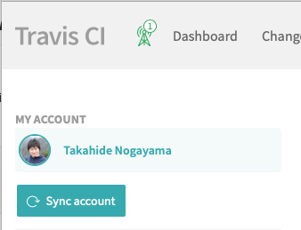
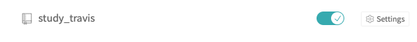

# study travis docker build


## travis を設定


1. create github repository => `study_travis`

2. add  `.travis.yml`  ファイル名が一字一句合ってる必要あり

    ```yaml
    language: bash
    script:
    - echo hello
    ```

3. dir
    ```
    ├── .travis.yml
    └── tests
        └── mytest.sh
    ```

4. https://travis-ci.org にログイン

5. sync accountをクリックし，Githubの情報を取得

    

6. オンにする

    

7.  自動的に，webhookがオンになる

    

8. pushするたび，テストが travis で実行される


### APIでビルドをトリガーする

1. TravisのプロファイルからTokenをコピーする

2. curlで以下のものを送る


## docker build

https://docs.travis-ci.com/user/docker/


```yaml
language: bash

services:
  - docker

before_install:
  - docker build -t nogayama/testimg:latest .

script:
  - tests/mytest.sh

```


これだけで，ビルド自体は完了するようだ．

```bash
# tests/mytest.sh
docker image list
exit 0

```

docker コマンド系が使える

## docker push


